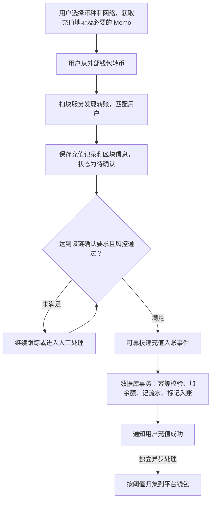
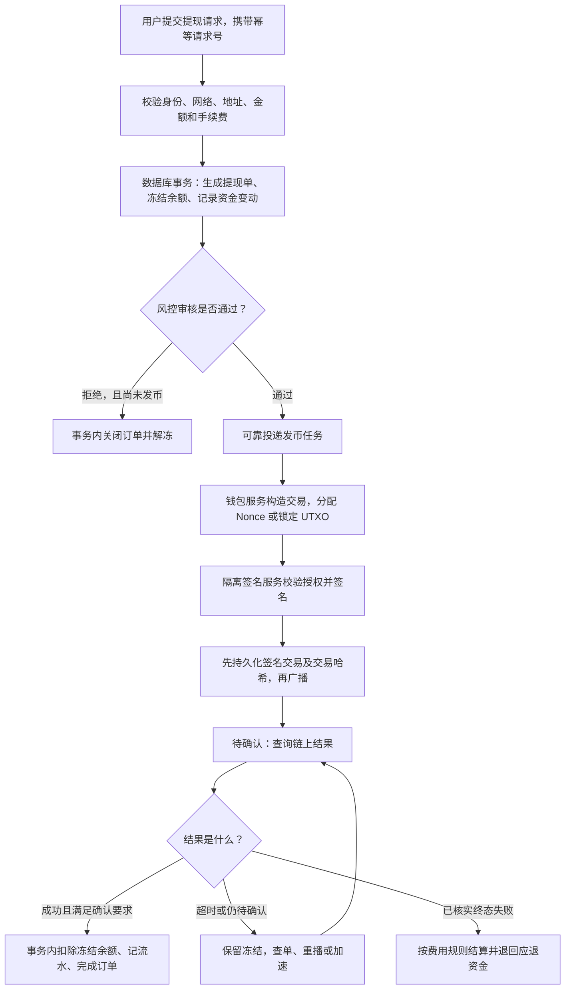

# 交易所核心模块与充值提现：面试简答

> 使用方式：第一节用于开场，第二、三节应对流程追问，第四节应对安全追问。
> 这是结合当前项目整理的回答模板。只把自己真正负责、落地过的内容说成“我做过”；生产改进不要冒充项目已经实现。

## 一、你负责的核心模块是什么？

**可以这样回答：**

“我主要负责交易所的资产和钱包链路，包括充值入账、提现、账户余额冻结解冻，以及链上交易跟踪和对账。

简单说，就是保证用户充进来的钱不少记、提走的钱不多付，每一笔资金变化都能查到原因。

这里我把系统分成两层：**账务服务管用户有多少钱，钱包服务管链上的钱怎么收、怎么转。** 两边通过业务订单关联，通过消息解耦，再用对账补漏。”

职责可以分成三块讲：

| 模块 | 大白话解释 |
| --- | --- |
| 资产账务 | 管可用余额、冻结余额、资金流水，避免重复入账和余额超扣 |
| 充值提现 | 分配充值地址、识别到账、审核提现、调用钱包签名广播 |
| 可靠性保障 | 处理重复消息、链上卡单、节点故障、漏单和账实不一致 |

**业务边界：**交易所买卖通常只是内部账本变化，不是每次成交都上链；充值和提现才连接内部账本与区块链。

## 二、充值流程怎么设计？

**一句话：先识别是谁充的钱，确认链上到账，再给内部账户加余额。**

**展开讲四点就够：**

1. **认人、认币、认网络。** 用“链 + 地址 + 必要的 Memo/Tag”匹配用户；代币还要核对合约地址，不能只看名字叫 USDT。不能根据 `0x` 就判断是以太坊，因为很多链地址格式相同。
2. **看到交易不等于可以入账。** 校验交易执行成功，按各链确认数或最终性规则处理。扫块保存高度和区块哈希，支持断点续扫、补扫和重组检测；不是所有链都固定等 12 个确认。
3. **同一笔只加一次钱。** 数据库唯一键识别充值事件，例如 ERC20 用 `(chain_id, tx_hash, log_index)`，BTC 用 `(chain_id, txid, vout)`。一笔交易可能有多笔转账，不能只用交易哈希去重。
4. **入账和归集分开。** 入账是给用户记账；归集是平台把分散的链上资产集中管理。归集失败单独重试，不把同一笔充值再入账一次。

> 例子：用户充入 100 USDT，链上满足确认要求后，内部余额增加 100。即使充值消息重发三次，也只能增加一次。

## 三、提现流程怎么设计？

**一句话：先冻结，再审核，再签名转出，链上确认成功后完成扣账。**

### 用一个数字讲清楚冻结与扣款

沿用项目的金额口径：**提现总额 100 USDT，平台手续费 1 USDT，用户到账 99 USDT。**

| 时点 | 可用余额 | 冻结余额 | 说明 |
| --- | --- | --- | --- |
| 原来有 200 | 200 | 0 | 尚未申请 |
| 提交申请 | 100 | 100 | 先占住这笔钱，防止再拿去交易或提现 |
| 提现成功 | 100 | 0 | 从冻结中结算 100，不再扣一次可用余额 |
| 发币前审核拒绝 | 200 | 0 | 原路解冻 |

平台向用户收的手续费，不等于链上实际 Gas；两者单独核算。已上链但执行失败也可能花掉 Gas，退款按明确的费用规则处理。

### 签名服务如何设计？

“业务服务不直接拿私钥，只提交已经授权的交易。签名服务再次核对链、地址、金额、调用数据和审批结果，再执行签名。

如果使用 MPC，达到门限的签名节点分散在独立安全域，各自保管分片，交互生成签名，不把完整私钥拼出来。”

**这里讲的是交易所托管钱包：**用户登录、验证和审批，不代表用户持有平台热钱包的分片。平台可以使用多个自动化签名节点；普通业务后端不一定持有分片。不要和“用户手机一片”的自托管 MPC 钱包混为一谈，也不要把 API Key 当作 MPC 分片。

## 四、怎么保证不丢钱、不重复打款？

面试抓住下面六点，不必堆算法名词：

| 问题 | 可靠做法 |
| --- | --- |
| 两个请求同时提现，余额被扣成负数？ | 用数据库条件更新或行锁冻结，检查更新结果；订单、余额和流水在同一个事务内完成 |
| 数据库成功了，Kafka 消息没发出去？ | 同一事务写业务数据和 Outbox 事件表，后台持续投递；允许重复发送，消费端幂等 |
| Kafka 重复消息，又打了一次币？ | 提现单状态条件更新防并发，钱包执行端也以业务单号幂等；保存订单与交易尝试的关联，重复任务查已有结果 |
| 两笔 EVM 交易抢到同一个 Nonce？ | 按链和出币地址串行分配，Redis 锁协调，数据库唯一约束兜底；加速交易允许复用同一笔业务已占用的 Nonce |
| 广播超时，是不是直接退钱？ | **不能。超时只是结果未知。** 先按已保存的交易哈希查链，必要时重播同一签名交易；不能重新拿一个 Nonce 再付一遍 |
| 长时间卡单、漏扫、链重组怎么办？ | 定时扫描非终态订单，对照链上记录、充提订单和资金流水补偿；异常报警，重组时暂停相关入账，已入账的走受控冲正 |

补充两个容易被追问的细节：

- **Nonce 锁不持有到交易确认。** 分配并持久化后释放短锁，用数据库预约记录和交易状态继续跟踪；否则同地址后续提现全被堵住。
- **广播成功不等于提现成功。** 拿到交易哈希只能说明有交易标识，最终仍需确认执行结果和链上确认程度。

## 五、面试最后怎么总结？

> “我负责的重点是资产和钱包链路，核心目标是钱记得准、转得对、异常能追踪。
>
> 充值是扫链识别用户，等确认后幂等入账；提现是先冻结余额，审核通过再交给隔离的钱包服务签名广播，等链上确认后结算。
>
> 可靠性上，数据库事务保证账务原子性，Outbox 加消费幂等保证消息可重试，钱包端业务单号防重复付款，定时对账发现漏单。最重要的一条是：交易超时不代表失败，不能一超时就退款或重新打币。”

## 六、对应当前项目，哪些已做、哪些要补？

以下路径相对于项目根目录 `00_framework`：

| 代码位置 | 已看到的实现 |
| --- | --- |
| `wallet/.../consumer/FinanceConsumer.java` 的 `handleDeposit` | 消费 `deposit` 消息，按地址或 Memo 匹配用户，调用充值入账 |
| `core/.../service/MemberWalletService.java` 的 `recharge/recharge2` | 保存充值记录、增加余额、记录资金流水 |
| `ucenter-api/.../controller/WithdrawController.java` 的 `withdrawCode` | 校验申请、冻结余额、保存提现单；小额走自动提现，大额走审核 |
| `wallet/.../consumer/FinanceConsumer.java` 的 `handleWithdraw` | 消费 `withdraw` 消息，调用对应币种的 RPC 放币 |
| `core/.../service/WithdrawRecordService.java` 的 `withdrawSuccess` | 更新成功状态、扣除冻结余额、记录提现流水 |

**不要把下面这些说成项目已经完善：**

- 当前充值入口是“先查有没有，再入账”，不能代替数据库唯一约束和并发控制。
- 当前提现接口在事务中直接发 Kafka，需要补上数据库与消息之间的可靠投递。
- 当前自动提现在 RPC 返回交易哈希后就调用 `withdrawSuccess`，此处未等待链上确认；成功处理方法也缺少明确的终态幂等保护。
- 本次核对的是账务端和 RPC 调用端，未核验各链 RPC 服务内部的扫块、确认、私钥管理实现。前面的流程图是生产设计建议，不是这些外部服务已实现的证明。
